# Bucketlist

Stop dreaming about your bucketlist and start living it. 
Because energy flows where intention goes. 
Set your bucketlist intentions today!

## Deployed Site
[Live website](https://bucketlist-2020.herokuapp.com/.)
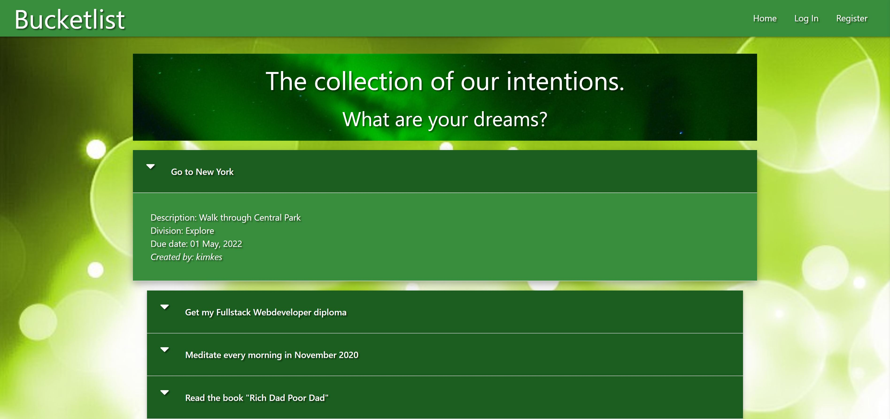

## UX 

### User Stories
* As a new user I can look at other peoples bucketlist intentions
* As a registered and logged in user I can set my own bucketlist intentention
As a Administrator
* Be able to add, edit and delete Devisions
* 

### Strategy
This website is for people who want to set there intantions instead of keeping them just in their head.

### Scope
* A Base Page with the header, footer and background image for all the other pages
* A Landing Page where visitors can see all the Intentions set by it's users
* A navigation bar and footer that change depending on whether the user is logged in or not
* A Register page for new users to create a profile
* A Login Page for users to Login
* A Profile Page for users to add a new intention and an option to delete their profile
* A Sign Out button that is easy to find on every page in the navigation bar and footer
* An Add Intention Page to Add a new Intention
* A Edit Intention Page to Edit a existing Intention
* A Divisions Page to see all the existing Divisions. Only for the admin user 
* An Add Division Page to Add a new Division. Only for the admin user 
* A Edit Divisions Page to Edit a excisting Division. Only for the admin user 

### Structure
* Color Scheme: green
* Every page has the same header and footer. Only the menu items change, depending on if the user is logged out, logged in or it's the admin
* intentions.html is the landing page and shows all added intentions from it's users
* register.html shows two required fields: username and password
* login.html is the same as the register.html
* etc etc xxxxxxxxxxxxxxxxxxxxxxxxxxxxxxxxxxxxxxxxxxxxxxxxxxxxxxxxxxxxxxxxxxxxxxxxxxxxxxxxxxxxxxxx

### Skeleton
* Header: Right Aligned Links from [Materialize](https://materializecss.com/)
* Menu: with Mobile Collapse Button on medium and small divices from [Materialize](https://materializecss.com/)
* Footer: from [Materialize](https://materializecss.com/)
* Base: with header, footer and background image
* Homepage/All Intentions: Collapsible Popout element from [Materialize](https://materializecss.com/)
* Register page: Card Panel and Text Input fields from [Materialize](https://materializecss.com/)
* Log In page: Card Panel and Text Input fields from [Materialize](https://materializecss.com/)
* Profile page: 2 Card Panels from [Materialize](https://materializecss.com/). Only for registered/logged in users
* Add Intention page: Card Panel, Text Input fields and Collabsable Select field from [Materialize](https://materializecss.com/). Only for registered/logged in users
* Manage Divisions page: Card Panel and buttons from [Materialize](https://materializecss.com/). Only for admin account
* Edit Division page: Card Panel, Text Input field from [Materialize](https://materializecss.com/). Only for admin account
* Add Division page: input field from [Materialize](https://materializecss.com/). Only for admin account

### Surface
* Font Family: standard
* Font Color: white & black
* Colors: three colors green from [Materialize](https://materializecss.com/) 
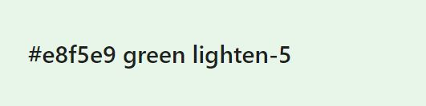

* Header: 
  * darken2
  * white text
* Footer
  * bottom = darken4
  * top = darken2 with icons from [Font Awesome](https://fontawesome.com/)
  * white text / icons
* Base: green background image from [Pixabay](https://pixabay.com/)
* Homepage/All Intentions
  * title with background image from [Pixabay](https://pixabay.com/)
  * darken4 collapsible element
  * darken2 popout element
  * white text
* Register page
  * lighten5 card with black text
  * darken4 button with white text
  * icons from [Font Awesome](https://fontawesome.com/)
* Log In page
  * lighten5 card with black text
  * darken4 button with white text
  * icons from [Font Awesome](https://fontawesome.com/)
* Profile page 
  * lighten5 cards with black text
  * darken4 & red button with white text
  * icons from [Font Awesome](https://fontawesome.com/)
* Add Intention page 
  * lighten5 card with black text
  * darken4 button with white text
  * icons from [Font Awesome](https://fontawesome.com/)
* Manage Divisions page 
  * all white text
  * title with background image from [Pixabay](https://pixabay.com/), same as homepage/all intentions
  * darken4 button
  * darken4 card + darken2 & red button
* Edit Division page
  * card lighten5
  * buttons red & darken4
* Add Division page
  * lighten5 card
  * darken4 button

### Mockups
The following wireframes were created using Balsamiq to design the website layout options. 

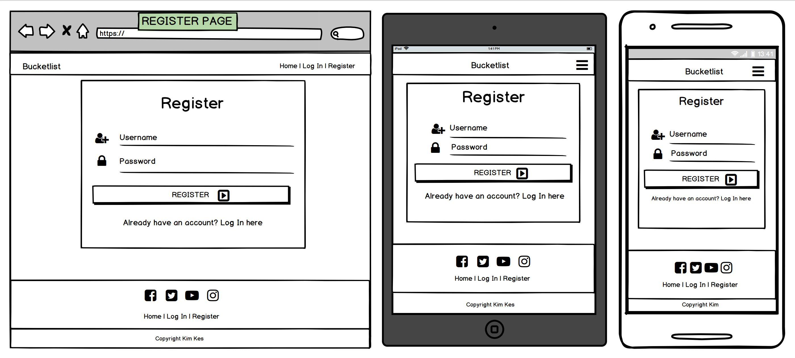
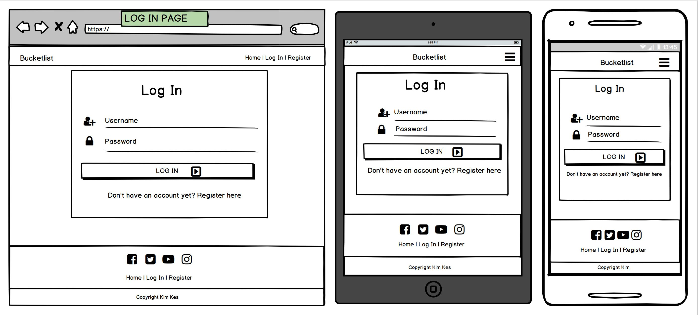
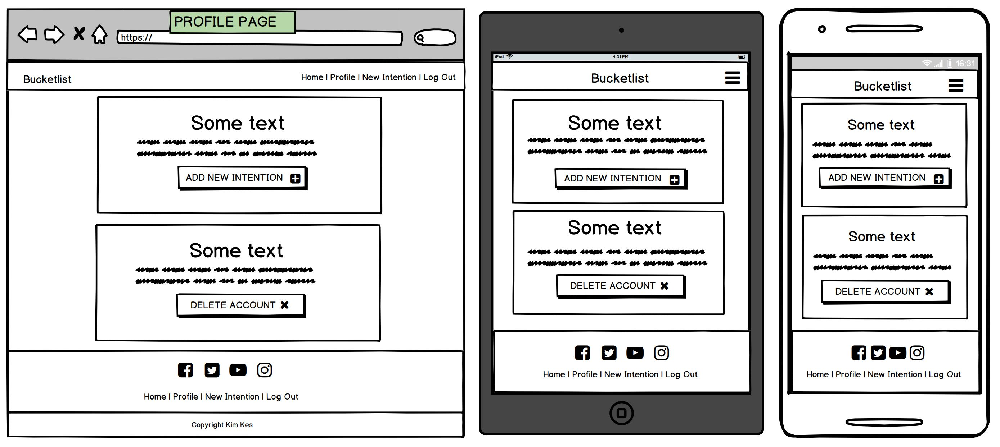
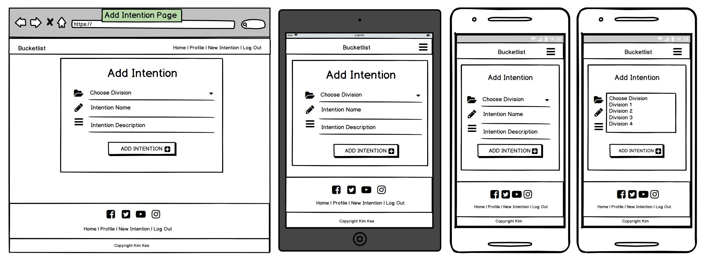
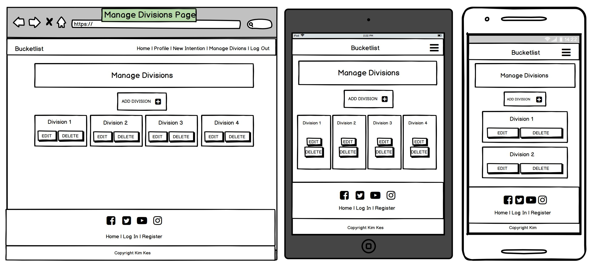

### Database Schema

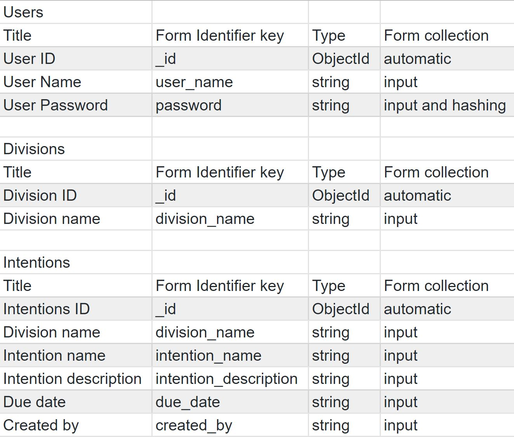

## Features
The webpage consists of the following features:

__The navigation bar__ 
Navbar for the logged out user: 

Navbar for the logged in user: 

Navbar for the admin user: 

Navbar for the mobile device user: 

__Footer__ 
Footer for the logged out user: 

Footer for the logged in user: 

Footer for the admin user: 

__Registration page__ 
The form is set to give feedback if username is too short. There is also error checking against confirmation password mismatch and some basic password criteria. Passwords are hashed using bcrypt and then saved to the database, hashed passwords are compared on login attempt. Once registered the user will be redirected to their profile page. There is also a link to go to the log in page here. 
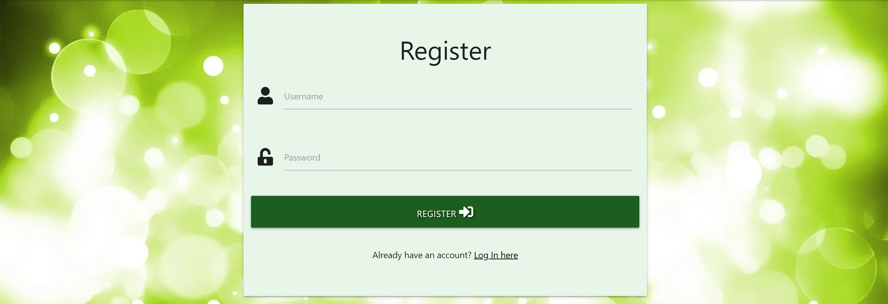

__Login page__ 
The login page is simple, users can enter their username and password. This is authenticated in python and feedback is given if the credentials are incorrect. For security all passwords are hashed and the hashed versions are compared. Successfully signing in to the site will direct the user to their profile page. There is also a link here to register a new user.  
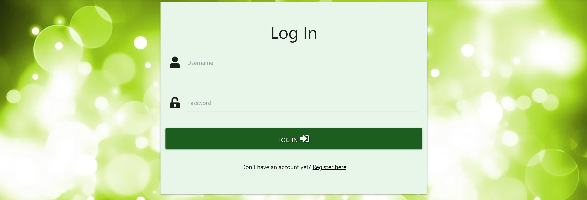

__Profile page__ 
Card 1: Shows the username and an extra button to add a new Intention.  
Card 2: This is where the profile can be deleted.

__Intentions Page__ 
Read (view) all intentions.  
This page shows all the posts made on the website, sorted by Username. 
* In collapsible-header: intention_name and edit_intention. edit_intention shows only if this intention was created by this user
* In collapsible-body: intention_description, division_name, due_date, created_by and delete_intention. delete_intention shows only if this intention was created by this user
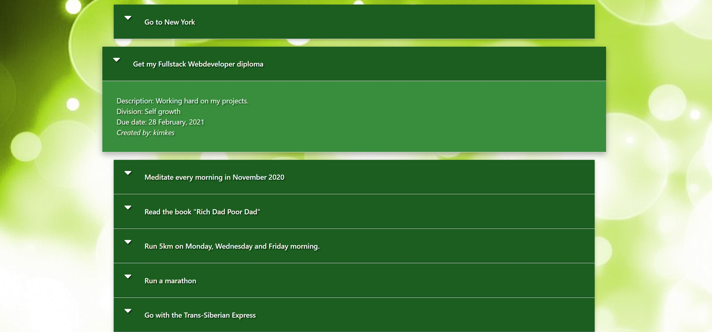

__Add Intention__ 
Add a New Intention.  
A simple form in the same style as all other forms on the website. When a user is logged in they can use this form to add a new intention.  
The following details need to be filled in on this form:
<ol>
 <li>Intention Division
 <li>Intention Name
 <li>Intention Description
 <li>Due Date
</ol>
When the Submit button is pressed, the post is sent to the Mongo database and will show up on the main Intentions Page.  

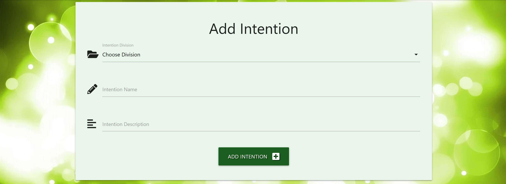

__Edit Intention__ 
Here the added Intention can be edited. 
The same form as Add Intention, only then filled in with the information when added.
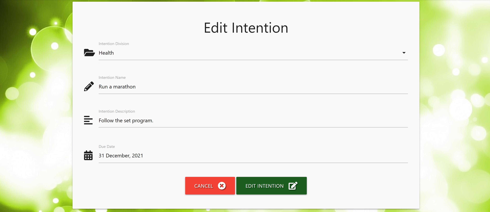

__Manage Divisions__ 
Overview of all the Divisions.  
Only accessible by the admin.
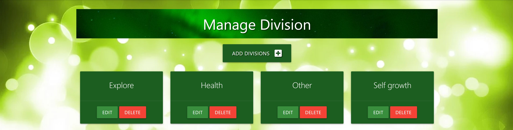

__Edit Division__ 
Edit a Division. Here you can change the name of a Division. This will be sent to the Mongo database and will be selectable when you want to add a New Intention. 
Only accessible by the admin.
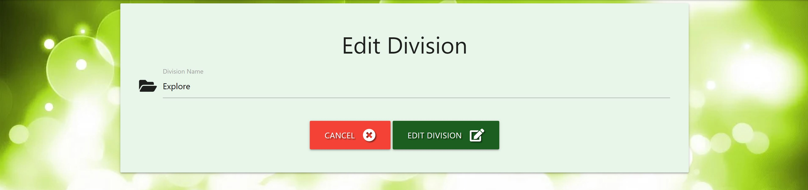

__Add Division__ 
Here you van add a New Division. This will be sent to the Mongo database and will be selectable when you want to add a New Intention. 
Only accessible by the admin.
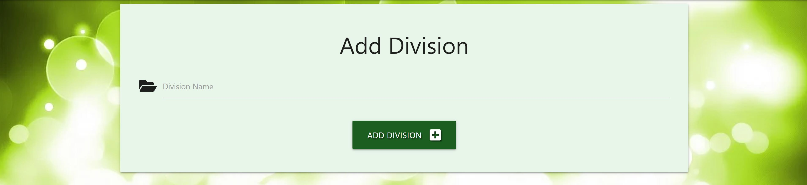

### Code structure

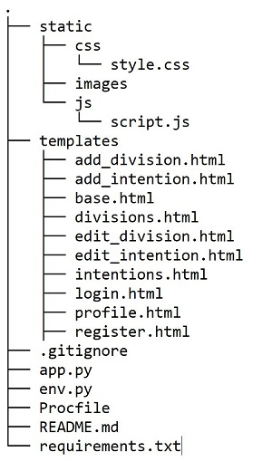

Webpage connections: xxxxxxxxxxxxxxxxxxxxxxxxxxxxxxxxxxxxxxxxxxxxxxxxxxxxxxxxxxxxxxxxxxxxxxxxxxxxxxxxxxxxxxxxxxxx
 

### Features Left to Implement
<ol>
 <li>A button to share your Intention on Social Media
 <li>When there a hounderds of Intentions added, a Pagination will be needed
 <li>Show all added Intentions by user on it's Profile Page
</ol>

## Technologies

### Languages
* [HTML5](https://en.wikipedia.org/wiki/HTML5) - Used as the main language for the templates 
* [CSS](https://en.wikipedia.org/wiki/Cascading_Style_Sheets) - Used for styling the webpage
* [JavaScript](https://en.wikipedia.org/wiki/JavaScript) - Used for some front end functionality
* Python3 - Used for backend data manipulation 
* PyMongo - Used to communicate with the mongoDB database 

### Libraries/Frameworks/Tools
* [Github](https://github.com/) - Used for version control 
* Flask 1.0.2 - Used as the main framework for my application 
* [Pixabay](https://pixabay.com/) - Free online images. Used for some images on website 
* [Fontawesome](https://fontawesome.com/) - Used for some icons on the website 
* [Materialize](https://materializecss.com/) - Used as the main frontend framework 
* [Heroku](https://heroku.com/) - Used to host the website 
* [GitHub](https://github.com/) Used to store my project source code 

### Databases
* [MongoDB](https://www.mongodb.com/)- Used as the main database technology

### Testing
* [W3C Markup](https://validator.w3.org/) - Used this to check my HTML for errors and typos
* [W3C CSS](https://jigsaw.w3.org/css-validator/) - Used this to check the validity of my CSS
* Google Chrome Developer Tools for testing different divice sizes
* [Responsinator](https://www.responsinator.com/) - for testing different divice sizes

__Registration page__ 
The Registration page is a required input field.  
The username requires a min length of 5 and a max length of 15.  
The password requires a min length of 5 and a max length of 15 and a pattern of "a-z,A-Z,0-9,5-15".  
When there is an error:
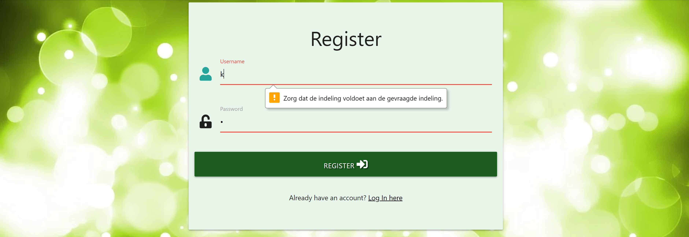

__Login page__ 
The Log In page is a required input field, with the same requirements as the Registration Page.
When there is an error:
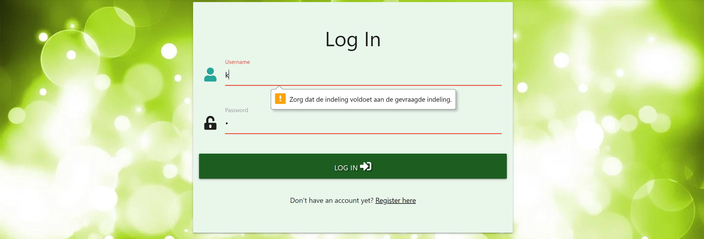

__Add Intention__ 
Intention Division, Intention Name and Intention Description are required fields.  
Intention Name is a required input field with a min length of 5 and a max length of 50.  
Intention Description requires is a required textarea with a min length of 5 and a max length of 200.  
Due Date needs to be filled in.  
When there is an error:
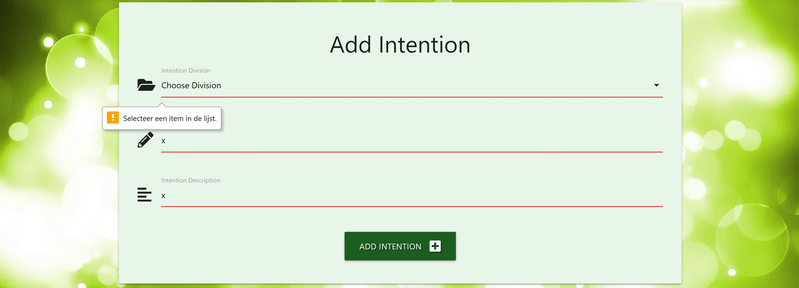

## Deployment

### GitHub xxxxxxxxxxxxxxxxxxxxxxxxxxxxxxxxxxxxxxxxxx

### Deploying to Heroku
The app is currently being deployed on Heroku using the master branch on Github.  
These are the steps that were taken to deploy to Heroku:
<ol>
 <li>In GitHub create a requirements.txt file for Heroku can install the necessary dependencies to run the app. The command used to create the file: pip3 freeze --local > requirements.txt.
 <li>In GitHub create a Procfile for Heroku to tell what kind of application it is deploying and how to run. The command used to create the file: echo web: python run.py > Procfile.
 <li>Create a free Heroku account.
 <li>Create a new app for the project, selecting a name for the app and choose the closest region.
 <li>In the Deploy tab choose deployment method GitHub, select your GitHub project.
 <li>In the Settings tab choose Reveal Config Vars and put in the same values as in your env.py.
 <li>In the Deploy tab choose Enable Automatic Deploys.
 <li>Open app.
</ol>
Env.py / Reveal Config Vars:

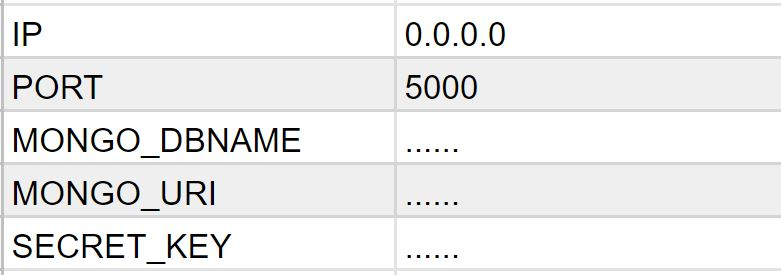

## Credits

### Content
The content is made up and written by me. The intentions are added by diffirent users.

### Media
The photos used in this website were obtained from [Pixabay](https://pixabay.com/).

### Acknowledgements
* [Code Institute course](https://codeinstitute.net/) course
* [YouTube](https://www.youtube.com/)
* [Slack](https://slack.com/) community
