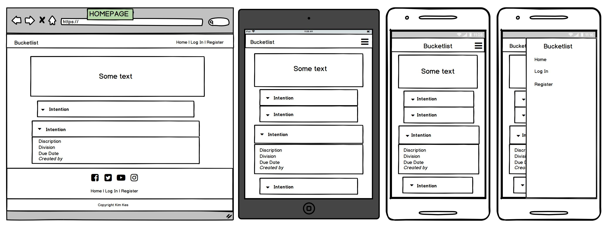
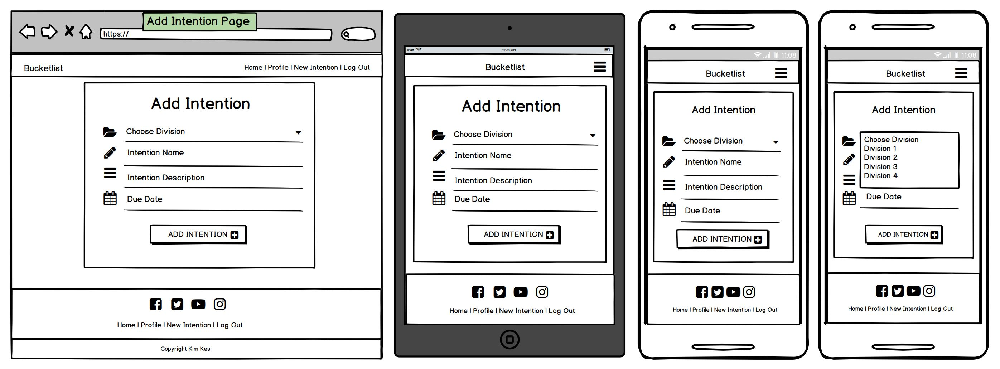
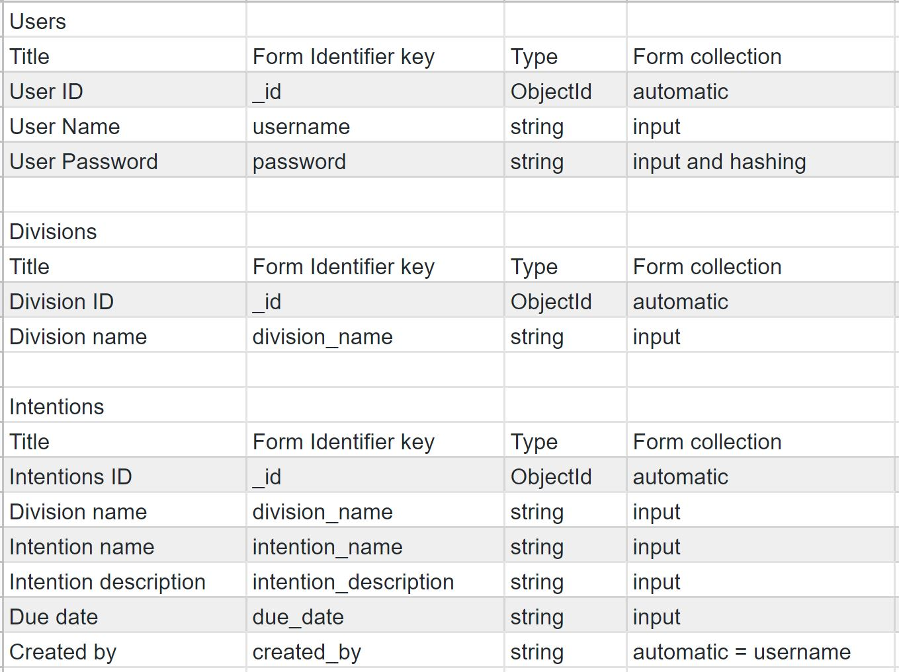
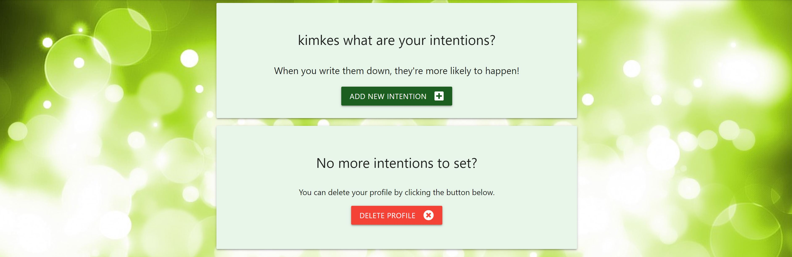
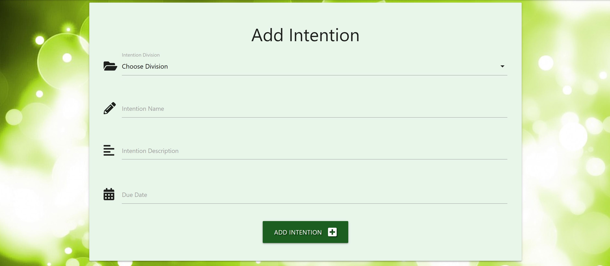
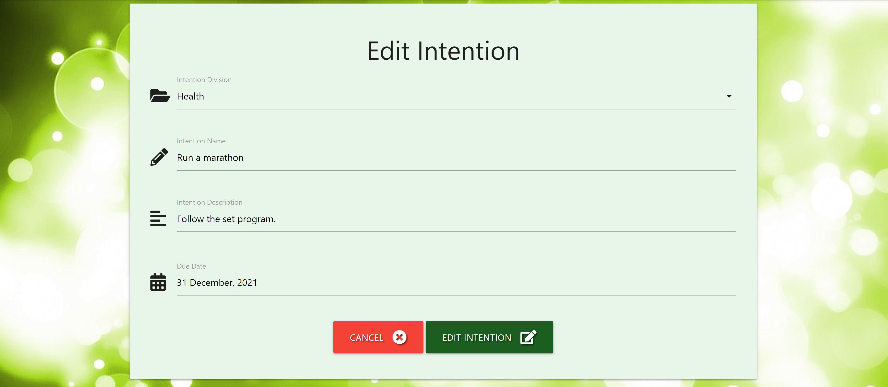
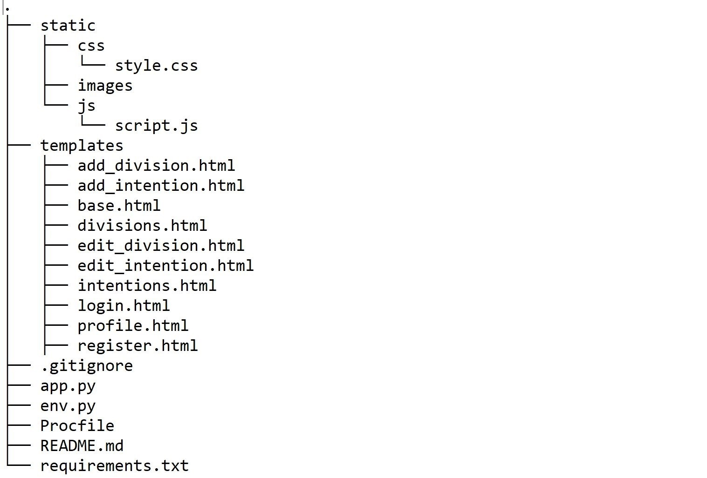
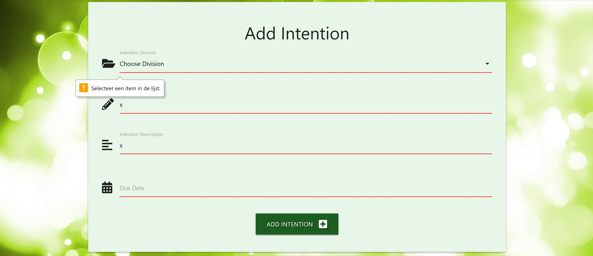
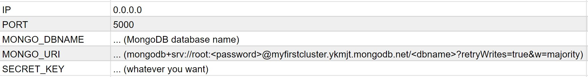

# Bucketlist

Stop dreaming about your bucketlist and start living it. 
Because energy flows where intention goes. 
Set your bucketlist intentions today!

## Deployed Site
[Live website](https://bucketlist-2020.herokuapp.com/.)

## UX 

### User Stories
As a new user:
* I can look at other peoples bucketlist Intentions
* I can Register myself

As a registrated & logged in user:
* I can Add my own bucketlist Intentention
* I can Edit my Intention
* I can Delete my Intention by clicking Done
* I can Delete my profile

As a Administrator:
* I can Add a new Division
* I can Edit a Division
* I can Delete a Division

### Strategy
This website is for people who want to set their Bucketlist Intention and share it with the other users of this website.  
By adding a Division, Intention, Description and a Due Date, the Intention will be more real, then when it stays in your head.

### Scope
* A Base Page with the header, footer and background image for all the other pages
* A Landing Page where visitors can see all the Intentions set by it's users
* A navigation bar and footer that change depending on whether the user is logged in or not
* A Register page for new users to create an account
* A Login Page for users to Login
* A Profile Page for users to add a new intention and an option to delete their account
* A Sign Out button that is easy to find on every page in the navigation bar and footer
* An Page to Add a new Intention
* A Edit Intention Page to Edit a existing Intention
* A Divisions Page to see all the existing Divisions. Only for the admin user 
* An Add Division Page to Add a new Division. Only for the admin user 
* A Edit Divisions Page to Edit a excisting Division. Only for the admin user 

### Structure
* Color Scheme: green
* Every page has the same header and footer. Only the menu items change, depending on if the user is logged out, logged in or it's the admin
* intentions.html is the landing page and shows all added intentions from it's users
* register.html shows two required fields: username and password
* login.html is the same as the register.html
* profile.html is the page where you can add a new intention or delete your account
* add_intention.html is where you can put the details of your intention
* edit_intention.html is where you can change the details of your intention
* divisions.html is the page where the admin can manage the divisions
* add_division.html is the page where the admin can add a new division
* edit_division.html is the page where the admin can edit a excisting division

### Skeleton
* Header: Right Aligned Links from [Materialize](https://materializecss.com/)
* Menu: with Mobile Collapse Button on medium and small divices from [Materialize](https://materializecss.com/)
* Footer: from [Materialize](https://materializecss.com/)
* Base: with header, footer and background image
* Homepage/All Intentions: Collapsible Popout element from [Materialize](https://materializecss.com/)
* Register page: Card Panel and Text Input fields from [Materialize](https://materializecss.com/)
* Log In page: Card Panel and Text Input fields from [Materialize](https://materializecss.com/)
* Profile page: 2 Card Panels from [Materialize](https://materializecss.com/). Only for registered/logged in users
* Add Intention page: Card Panel, Text Input fields and Collabsable Select field from [Materialize](https://materializecss.com/). Only for registered/logged in users
* Manage Divisions page: Card Panel and buttons from [Materialize](https://materializecss.com/). Only for admin account
* Edit Division page: Card Panel, Text Input field from [Materialize](https://materializecss.com/). Only for admin account
* Add Division page: input field from [Materialize](https://materializecss.com/). Only for admin account

### Surface
* Font Family: standard
* Font Color: white & black
* Colors: three colors green from [Materialize](https://materializecss.com/) 

* Header: 
  * darken2
  * white text
  * icon from [Font Awesome](https://fontawesome.com/)
* Footer
  * bottom = darken4
  * top = darken2 with icons from [Font Awesome](https://fontawesome.com/)
  * white text / icons
* Base: green background image from [Pixabay](https://pixabay.com/)
* Homepage/All Intentions
  * title with background image from [Pixabay](https://pixabay.com/)
  * darken4 collapsible element
  * darken2 popout element
  * white text
* Register page
  * lighten5 card with black text
  * darken4 button with white text
  * icons from [Font Awesome](https://fontawesome.com/)
* Log In page
  * lighten5 card with black text
  * darken4 button with white text
  * icons from [Font Awesome](https://fontawesome.com/)
* Profile page 
  * lighten5 cards with black text
  * darken4 & red button with white text
  * icons from [Font Awesome](https://fontawesome.com/)
* Add Intention page 
  * lighten5 card with black text
  * darken4 button with white text
  * icons from [Font Awesome](https://fontawesome.com/)
* Edit Intention Page
  * lighten5 card with black text
  * darken4 button with white text
  * icons from [Font Awesome](https://fontawesome.com/)
* Manage Divisions page 
  * all white text
  * title with background image from [Pixabay](https://pixabay.com/), same as homepage/all intentions
  * darken4 button
  * darken4 card + darken2 & red button
* Edit Division page
  * card lighten5
  * buttons red & darken4
* Add Division page
  * lighten5 card
  * darken4 button

### Mockups
The following wireframes were created using Balsamiq to design the website layout options. 

### Database Schema

## Features
The webpage consists of the following features:

__The navigation bar__ 
The <ins>Bucketlist Title</ins> and <ins>Home</ins> link will lead to intentions.html (landing page).  
The <ins>Register</ins> link will lead to register.html.  
The <ins>Login</ins> link will lead to login.html.  
The <ins>Profile</ins> link will lead to profile.html.  
The <ins>New Intention</ins> link will lead to add_intention.html.  
The <ins>Manage Divisions</ins> link will lead to edit_divisions.html.  
The <ins>Logout</ins> link wil lead to login.html.

Navbar for the logged out user: 

Navbar for the logged in user: 

Navbar for the admin user: 

Navbar for the mobile device user: 

__Footer__ 
Footer with Copyright, Social Media icons and the links as in the Navbar. 
Footer for the logged out user: 

Footer for the logged in user: 

Footer for the admin user: 

__Register page__ 
Register with a username and password. Once registered the user will be redirected to their profile page. There is also a link to go to the log in page for users who are already registrated.

__Login page__ 
Successfully signing in to the site will direct the user to their profile page. There is also a link here to register a new user.

__Profile page__ 
Card 1: Shows the username and an extra button to add a new Intention.  
Card 2: This is where the profile can be deleted.

__Intentions Page__ 
Read (view) all intentions.  
This page shows all the posts made on the website, sorted by Username. 
* In collapsible-header: intention_name and Edit button. The Edit button shows only if this intention was created by this user. When pressed, it will lead to the page edit_intention.html
* In collapsible-body: intention_description, division_name, due_date, created_by and done button. The done button shows only if this intention was created by this user. When pressed, the intention will be deleted.

__Add Intention__ 
Add a New Intention.  
A simple form in the same style as all other forms on the website. When a user is logged in they can use this form to add a new intention.  
The following details need to be filled in on this form:
<ol>
 <li>Division Name
 <li>Intention Name
 <li>Intention Description
 <li>Due Date
</ol>
When the Submit button is pressed, the post is sent to the Mongo database and will show up on the main Intentions Page.  
The __created_by__ is automatic created and linked with the __username__. 

__Edit Intention__ 
Here the added Intention can be edited. 
The same form as Add Intention, only then filled in with the information when added.

__Manage Divisions__ 
Overview of all the Divisions.  
Only accessible by the admin.

__Edit Division__ 
Edit a Division. Here you can change the name of a Division. This will be sent to the Mongo database and will be selectable when you want to add a New Intention. 
Only accessible by the admin.

__Add Division__ 
Here you van add a New Division. This will be sent to the Mongo database and will be selectable when you want to add a New Intention. 
Only accessible by the admin.

### Code structure

### Features Left to Implement
<ol>
 <li>A button to share your Intention on Social Media
 <li>When there a hounderds of Intentions added, a Pagination will be needed
 <li>Show all added Intentions by user on it's Profile Page
 <li>Expand the Profile Page with more Database details
</ol>

## Technologies

### Languages
* [HTML5](https://en.wikipedia.org/wiki/HTML5) - Used as the main language for the templates 
* [CSS](https://en.wikipedia.org/wiki/Cascading_Style_Sheets) - Used for styling the webpage
* [JavaScript](https://en.wikipedia.org/wiki/JavaScript) - Used for some front end functionality
* Python3 - Used for backend data manipulation 
* PyMongo - Used to communicate with the mongoDB database 

### Libraries/Frameworks/Tools
* [Github](https://github.com/) - Used for version control 
* Flask 1.0.2 - Used as the main framework for my application 
* [Pixabay](https://pixabay.com/) - Free online images. Used for some images on website 
* [Fontawesome](https://fontawesome.com/) - Used for some icons on the website 
* [Materialize](https://materializecss.com/) - Used as the main frontend framework 
* [Heroku](https://heroku.com/) - Used to host the website 
* [GitHub](https://github.com/) Used to store my project source code 

### Databases
* [MongoDB](https://www.mongodb.com/)- Used as the main database technology

### Testing
* [W3C Markup](https://validator.w3.org/) - Used this to check my HTML for errors and typos
* [W3C CSS](https://jigsaw.w3.org/css-validator/) - Used this to check the validity of my CSS
* Google Chrome Developer Tools for testing different divice sizes
* [Responsinator](https://www.responsinator.com/) - for testing different divice sizes

__Registration page__ 
The Registration page has two required input fields.  
The username requires a min length of 5 and a max length of 15.  
The password requires a min length of 5 and a max length of 15 and a pattern of "a-z,A-Z,0-9,5-15".  
When there is an error:

__Login page__ 
The Log In page has two required input fields, with the same requirements as the Registration Page.
When there is an error:

__Add Intention__ 
Intention Division, Intention Name and Intention Description are required fields.  
Intention Name is a required input field with a min length of 5 and a max length of 50.  
Intention Description requires is a required textarea with a min length of 5 and a max length of 200.  
Due Date needs to be filled in.  
When there is an error:

## Deployment

### Deploying to Heroku
The app is currently being deployed on Heroku using the master branch on Github.  
These are the steps that were taken to deploy to Heroku:
<ol>
 <li>In GitHub create a requirements.txt file for Heroku can install the necessary dependencies to run the app. The command used to create the file: pip3 freeze --local > requirements.txt.
 <li>In GitHub create a Procfile for Heroku to tell what kind of application it is deploying and how to run. The command used to create the file: echo web: python run.py > Procfile.
 <li>Create a free Heroku account.
 <li>Create a new app for the project, selecting a name for the app and choose the closest region.
 <li>In the Deploy tab choose deployment method GitHub, select your GitHub project.
 <li>In the Settings tab choose Reveal Config Vars and put in the same values as in your env.py.
 <li>In the Deploy tab choose Enable Automatic Deploys.
 <li>Open app.
</ol>
Env.py / Reveal Config Vars:

## Credits

### Content
The content is made up and written by me. The Intentions are added by different users.

### Media
The images used on this website were obtained from [Pixabay](https://pixabay.com/). The images are used with the direct html on the page.

### Acknowledgements
* [Code Institute course](https://codeinstitute.net/) course
* [YouTube](https://www.youtube.com/)
* [Slack](https://slack.com/) community
