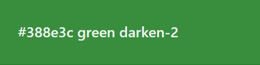
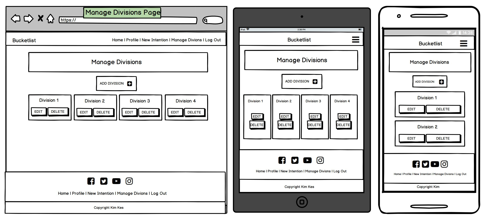

# Bucketlist

Stop dreaming about your bucketlist and start living it. 
Because energy flows where intention goes. 
Set your bucketlist intentions today!

## Deployed Site
[Live website](https://bucketlist-2020.herokuapp.com/.)

## UX 

### User Stories
* As a new user I can look at other peoples bucketlist intentions
* As a registered and logged in user I can set my own bucketlist intententions

### Strategy
This website is for people who want to set there intantions instead of keeping them just in their head.

### Scope
* A Landing Page that is easy to navigate
* A navigation bar and footer that change depending on whether the user is logged in or not
* A register and login form for users to either create a new account or to log in
* A Profile Page for users to add an intention and an option to delete their account
* A Sign Out button that is easy to find on every page in the navigation bar and footer
* An Intentions page where users can see all the bucketlist intentions on the website
* An admin page to manage the divisions

### Structure
* Color Scheme: green
* Every page has the same header and footer. Only the menu items change, depending on if the user is logged out, logged in or it's the admin
* intentions.html shows all added intentions from all users
* register.html shows two required fields: username and password
* login.html is the same as the register.html
* etc etc

### Skeleton
* Header: Right Aligned Links from [Materialize](https://materializecss.com/)
* Menu: with Mobile Collapse Button on medium and small divices from [Materialize](https://materializecss.com/)
* Footer: from [Materialize](https://materializecss.com/)
* Base: with header, footer and background image
* Homepage/All Intentions: Collapsible Popout element from [Materialize](https://materializecss.com/)
* Register page: Card Panel and Text Input fields from [Materialize](https://materializecss.com/)
* Log In page: Card Panel and Text Input fields from [Materialize](https://materializecss.com/)
* Profile page: Card Panel from [Materialize](https://materializecss.com/). Only for registered/logged in users
* Add Intention page: Card Panel, Text Input fields and Collabsable Select field from [Materialize](https://materializecss.com/). Only for registered/logged in users
* Manage Divisions page: Card Panel and buttons from [Materialize](https://materializecss.com/). Only for admin account
* Edit Division page: Card Panel, Text Input field from [Materialize](https://materializecss.com/). Only for admin account
* Add Division page: input field from [Materialize](https://materializecss.com/). Only for admin account

### Surface
* Font Family: standard
* Font Color: white & black
* Colors: three colors green from [Materialize](https://materializecss.com/) 

* Header: 
  * darken2
  * white text
* Footer
  * bottom = darken4
  * top = darken2 with icons from [Font Awesome](https://fontawesome.com/)
  * white text / icons
* Base: green background image from [Pixabay](https://pixabay.com/)
* Homepage/All Intentions
  * title with background image from [Pixabay](https://pixabay.com/)
  * darken4 collapsible element
  * darken2 popout element
  * white text
* Register page
  * lighten5 card with black text
  * darken4 button with white text
  * icons from [Font Awesome](https://fontawesome.com/)
* Log In page
  * lighten5 card with black text
  * darken4 button with white text
  * icons from [Font Awesome](https://fontawesome.com/)
* Profile page 
  * lighten5 card with black text
   * darken4 & red button with white text
   * icons from [Font Awesome](https://fontawesome.com/)
* Add Intention page 
  * lighten5 card with black text
  * darken4 button with white text
  * icons from [Font Awesome](https://fontawesome.com/)
* Manage Divisions page 
  * all white text
  * title with background image from [Pixabay](https://pixabay.com/), same as homepage/all intentions
  * darken4 button
  * darken4 card + darken2 & red button
* Edit Division page
  * card lighten5
  * buttons red & darken4
* Add Division page
  * lighten5 card
  * darken4 button

### Mockups
The following wireframes were created using Balsamiq to design the website layout options. 

xxxxxx

### Database Schema

## Features
The webpage consists of the following features:

__The navigation bar__ 
Navbar for the logged out user: 

Navbar for the logged in user: 

Navbar for the admin user: 

Navbar for the mobile device user: 

__Footer__ 
Footer for the logged out user: 

Footer for the logged in user: 

Footer for the admin user: 

__Registration page__ 
The form is set to give feedback if username is too short. There is also error checking against confirmation password mismatch and some basic password criteria. Passwords are hashed using bcrypt and then saved to the database, hashed passwords are compared on login attempt. Once registered the user will be redirected to their profile page. There is also a link to go to the log in page here.

When there is an error:

__Login page__ 
The login page is simple, users can enter their username and password. This is authenticated in python and feedback is given if the credentials are incorrect. For security all passwords are hashed and the hashed versions are compared. Successfully signing in to the site will direct the user to their profile page. There is also a link here to register a new user.

When there is an error:

__Profile page__ 
The profile page is a users space to 
This is also where you will delete your profile.

__Intentions Page__ 
Read (view) all intentions.
This page shows all the posts made on the website.

__Add Intention__ 
Add a New Intention.
A simple form in the same style as all other forms on the website. When a user is logged in they can use this form to add a new intention.  
The following details need to be filled in on this form:
<ol>
 <li>Intention Division
 <li>Intention Name
 <li>Intention Description
</ol>
When the Submit button is pressed, the post is sent to the Mongo database and will show up on the main Intentions Page.

When there is an error:

__Manage Divisions__ 
Overview of all the Divisions. 

__Edit Division__ 
Edit a Division. Here you can change the name of a Division. This will be sent to the Mongo database and will be selectable when you want to add a New Intention.

__Add Division__ 
Add a New Division. Here you van add a New Division. This will be sent to the Mongo database and will be selectable when you want to add a New Intention.

### Code structure

### Features Left to Implement
<ol>
 <li>A button to share your Intention on Social Media.
 <li>
</ol>

## Technologies

### Languages
* [HTML5](https://en.wikipedia.org/wiki/HTML5) - Used as the main language for the templates 
* [CSS](https://en.wikipedia.org/wiki/Cascading_Style_Sheets) - Used for styling the webpage
* [JavaScript](https://en.wikipedia.org/wiki/JavaScript) - Used for some front end functionality
* Python3 - Used for backend data manipulation 
* PyMongo - Used to communicate with the mongoDB database 

### Libraries/Frameworks/Tools
* [Github](https://github.com/) - Used for version control 
* Flask 1.0.2 - Used as the main framework for my application 
* [Pixabay](https://pixabay.com/) - Free online images. Used for some images on website 
* [Fontawesome](https://fontawesome.com/) - Used for some icons on the website 
* [Materialize](https://materializecss.com/) - Used as the main frontend framework 
* [Heroku](https://heroku.com/) - Used to host the website 
* [GitHub](https://github.com/) Used to store my project source code 

### Databases
* [MongoDB](https://www.mongodb.com/)- Used as the main database technology

### Testing
* [W3C Markup](https://validator.w3.org/) - Used this to check my HTML for errors and typos
* [W3C CSS](https://jigsaw.w3.org/css-validator/) - Used this to check the validity of my CSS
* Google Chrome Developer Tools for testing different divice sizes
* [Responsinator](https://www.responsinator.com/) - for testing different divice sizes

## Deployment

### GitHub / Heroku repository....

## Credits

### Content
The content is made up and written by me. The intentions are added by diffirent users.

### Media
The photos used in this website were obtained from [Pixabay](https://pixabay.com/).

### Acknowledgements
* [Code Institute course](https://codeinstitute.net/) course & Student Care
* [YouTube](https://www.youtube.com/)
* [Slack](https://slack.com/) community
